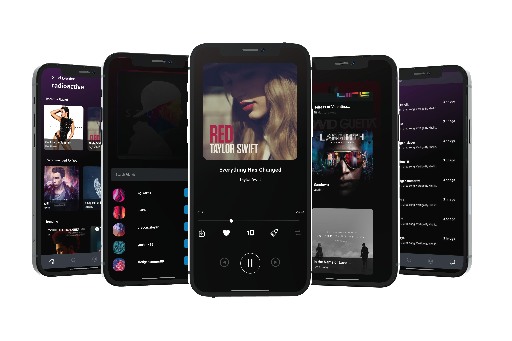
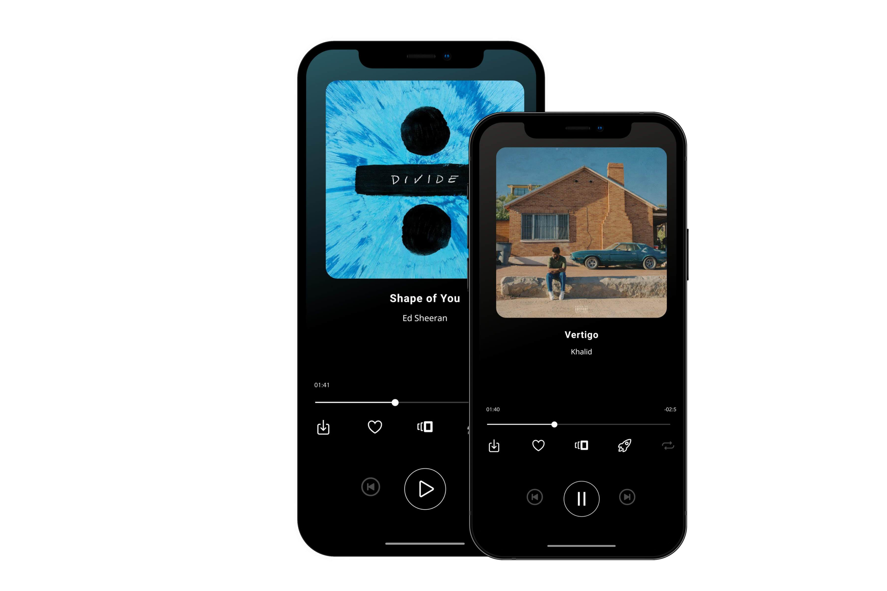
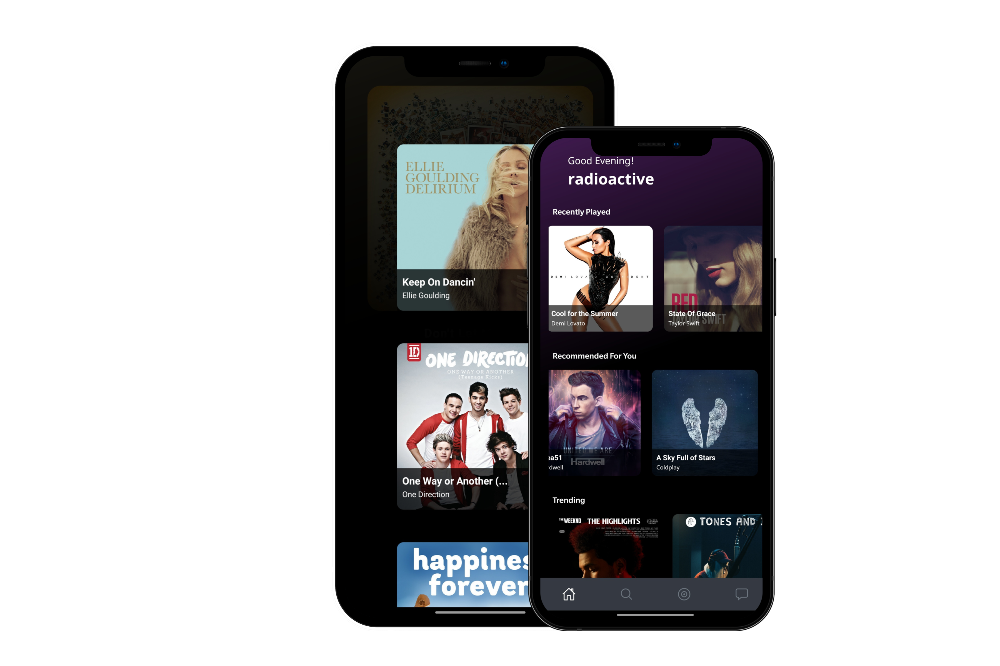
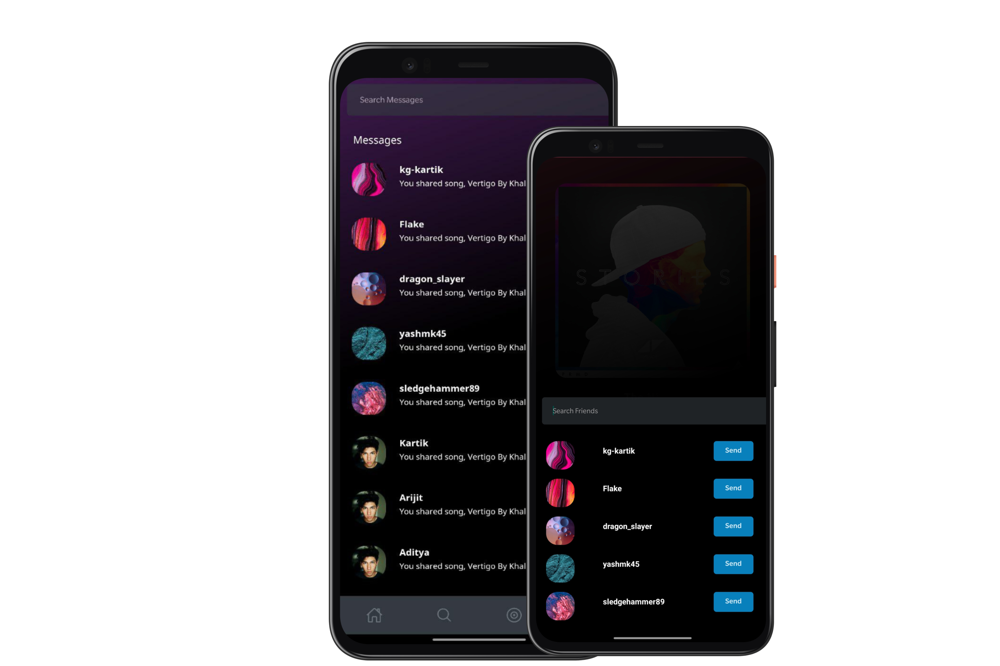

<p align="center">

[](https://forthebadge.com)
[](https://forthebadge.com)
[](https://forthebadge.com)


</p>

<!-- PROJECT LOGO -->
<br/>
<p align="center">
  <a href="https://rezonanceindia.tech/">
    
  </a>

  <h1 align="center">rezonance</h1>
  <p align="center">
    
    <!-- <br /> -->
    <strong>Rezonance APP</strong>
    <!-- <br /> -->
    <a href="https://rezonanceindia.tech/"><strong>Visit the website »</strong></a>
    <br />
    <br />
    <a href="https://rezonanceindia.tech/">View Demo</a>
    ·
    <a href="https://github.com/rezonance-india/engine-api/issues">Report Bug</a>
    ·
    <a href="https://github.com/rezonance-india/engine-api/issues">Request Feature</a>
  </p>
</p>


<!-- TABLE OF CONTENTS -->
## Table of Contents

* [About the Project](#about-the-project)
  * [AI Powered Recommendations](#ai-powered-recommendations)
  * [In App Sharing](#in-app-sharing)
  * [Unlimited Downloads](#unlimited-downloads)
  * [Ad Free](#ad-free)

* [Getting Started](#getting-started)
  * [Prerequisites](#prerequisites)
  * [Installation](#installation)
* [Product Screenshots](#Product-Screenshots)
* [Roadmap](#roadmap)
* [Contributing](#contributing)
* [Contact](#contact)


<!-- ABOUT THE PROJECT -->
## About The Project
rezonance is a music streaming application that fetches music from free sources available on the internet. It is completely free and open-source. 

These are the features that we currently provide. 
<br/>

:notes: AI powered recommendations

:rocket: In app sharing 

:arrow_down: Unlimited downloads

:space_invader: Ad Free

:page_facing_up: No subscription

:sparkles: New Releases

:mag: Auto Complete & Auto Correct Search


<br />

## AI Powered Recommendations
Discover new music based on the song you're currently listening to.

We used content based recommendations to find music similar to the one chosen by the user based on cosine similarity of metrics of songs.

<br />

## In App Sharing
Users can share songs with their friends within the application. No need to copy links or send screenshots

<br />

## Unlimited Downloads
Listen to your favourite songs even without an internet connection. Download songs without any limit.

<br />

## Ad Free
Enjoy ad-free seamless playback. Cuz even we don't like ads

<br />
<br />

## Built With

</br>
<p float = "left">


</p>


<!-- GETTING STARTED -->
## Getting Started

To get a local copy up and running follow these simple example steps.

### Prerequisites

* Npm
* Setup dev environment for react native following : https://reactnative.dev/docs/environment-setup

### Installation

1. Clone the repo

```sh
git clone https://github.com/rezonance-india/app
```

2. Install packages

```sh
npm install
```

3.Start the metro bundler

```sh
npm react-native start
```

4. Start the application

```sh
npm react-native run-android (For android)
```

<br />

### Referenced Repositories

[Salyd Server](https://github.com/rezonance-india/rezonancebackend)


## Product Screenshots








<!-- ROADMAP -->
## Roadmap

See the [open issues](https://github.com/rezonance-india/engine-api/issues) for a list of proposed features (and known issues).


<!-- CONTRIBUTING -->
## Contributing

Contributions are what make the open source community such an amazing place to be learn, inspire, and create. Any contributions you make are **greatly appreciated**.

1. Fork the Project
2. Create your Feature Branch (`git checkout -b feature/AmazingFeature`)
3. Commit your Changes (`git commit -m 'Add some AmazingFeature'`)
4. Push to the Branch (`git push origin feature/AmazingFeature`)
5. Open a Pull Request


<!-- CONTACT -->
## Contact

Kartik Goel - [GitHub](https://github.com/kg-kartik) - goel.kartik39@gmail.com

Arijit Roy - [GitHub](https://github.com/radioactive11) - roy.arijit2001@gmail.com


